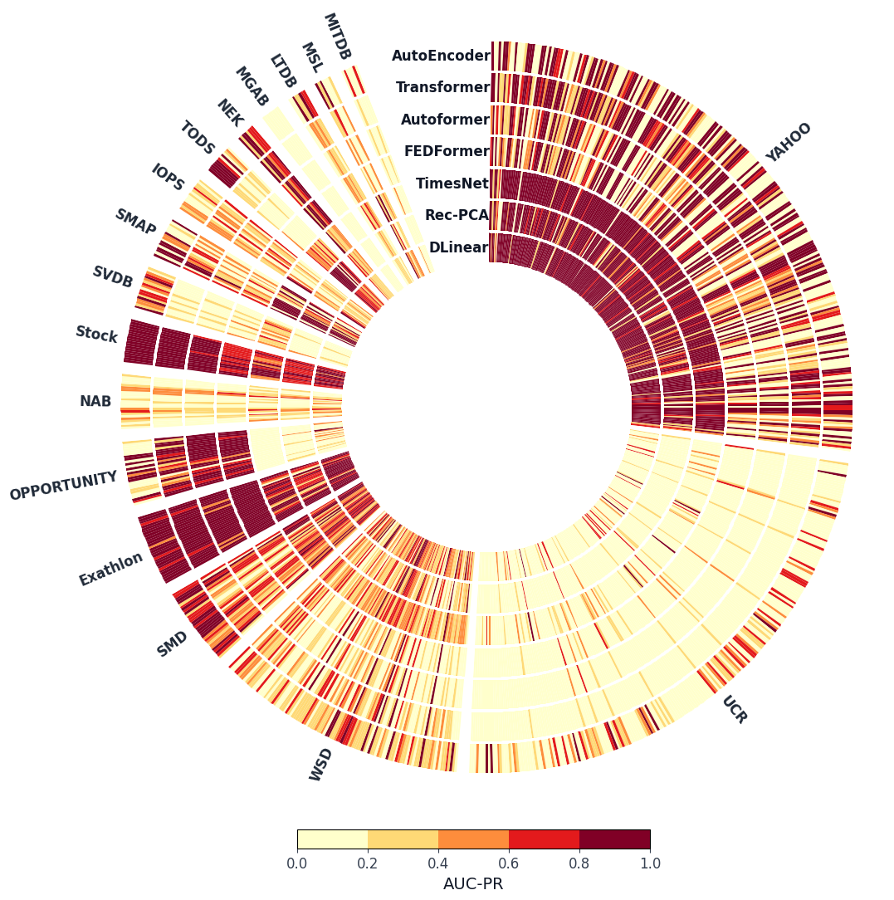

DeepTSAD_eval
================

DeepTSAD_eval is a research codebase for evaluating and comparing time-series anomaly detection models on benchmark datasets (UCR/TSB-AD), collecting results, and producing analysis plots. The repository contains data preparation, training, inference, evaluation and utilities for experiments used in comparative studies.

**Quick Summary**
- **Purpose**: Reproduce and evaluate multiple reconstruction based time series anomaly detection models and gather comparative results.
- **Environment**: See [environment.yml](environment.yml) for the Conda environment; a virtualenv is also used in development.
- **Code**: Core scripts and pipelines live under [src/](src/).
- **Data**: Datasets are in [Datasets/](Datasets/).
- **Results/plots**: Stored in [results/](results/) and [Figures/](Figures/).


<p align="center"></p>

Installation
------------

1. Create the environment from `environment.yml` with Conda:

```bash
conda env create -f environment.yml
conda activate deeptsad_eval
```

Data preparation
----------------
Download the datasets used for evaluation (UCR and TSB-AD subsets) and place them in the `Datasets/` directory. The instructions for downloading the datasets can be found in the respective repositories UCR (https://www.cs.ucr.edu/~eamonn/time_series_data_2018/) and TSB-AD (https://github.com/TheDatumOrg/TSB-AD)

The expected structure is:

```Datasets/
├── UCR/
├── TSB-AD-U/
├── File_List
``` 

Quick start
-----------


 Run pipeline scripts, available in `src/pipeline_*.py`, to train and evaluate models on the datasets. For example, to run the DLinear pipeline:

```bash
python src/pipeline_dlinear.py
```

 Run the tuning scripts to find best parameters for each model on the datasets:

```bash
python src/tuning.py
```

Run evaluation and aggregation scripts to produce result CSVs using the best tuning parameters:

```bash
python src/evaluate_best.py
python src/evaluate_best_ucr.py
```


Repository layout
-----------------


- **Datasets/**: Dataset collections and lists used in experiments (UCR, TSB-AD subsets).
- **Figures/**: Generated figures and notebooks for plotting and analyses.
- **Notebooks/**: Jupyter notebooks used for analysis and plotting.
- **results/**: CSVs and per-method result folders produced by evaluations.
- **src/**: Main code for training, inference, evaluation, pipelines and utilities. Key files:
	- [src/training.py](src/training.py) — training utilities.
    - [src/eval.py](src/eval.py) — evaluation utilities.
	- [src/inference.py](src/inference.py) — inference utilities .
	- [src/evaluate_best.py](src/evaluate_best.py) and [src/evaluate_best_ucr.py](src/evaluate_best_ucr.py) — evaluation scripts used to aggregate and compute metrics.
    - [src/tuning.py](src/tuning.py) — hyperparameter tuning scripts for models and datasets.
    - [src/pipeline_*.py](src/pipeline_*.py) — pipeline scripts for training and evaluating specific models (e.g. DLinear, AutoEncoder, etc.).
    - [src/evalution/](src/evaluation/) — evaluation code from TSB-AD for computing metrics and scores.
    - [src/utils/](src/utils/) — utility functions from Time-Series-Library for data loading, processing, and other common tasks.
    - [src/layers/](src/layers/) — implementations of custom layers used in models from the Time-Series-Library.
    - [src/models/](src/models/) — implementations of models used in evaluations from the Time-Series-Library and custom model for the AutoEncoder.


Sources
-------
- **Data & evaluation scoring:** The datasets and evaluation code used for some experiments are from the TSB-AD project: https://github.com/TheDatumOrg/TSB-AD
- **Model implementations:** Many model implementations come from the Time-Series-Library: https://github.com/thuml/Time-Series-Library


Cite this work
---------
Incoming